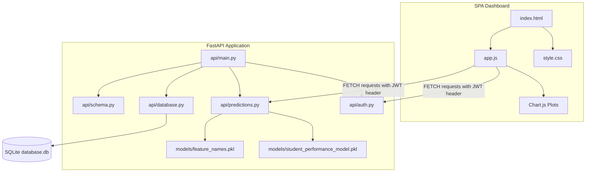

# Gradely AI: Student Performance Predictor & Dashboard

An end-to-end, production-ready machine learning web application that predicts a student's final grade (G3) using academic, demographic, and behavioral features. Powered by a **FastAPI** backend and an interactive **Single Page Application (SPA)** frontend dashboard.

---

## Key Features

1. **Machine Learning Inference**: A Gradient Boosting Regressor (trained on the Student Performance dataset) that predicts final grades (0-20) in real-time.
2. **Interactive SPA Dashboard**: Modern, responsive dashboard utilizing HSL-based color variables, custom scrollbars, and fluid layouts (collapsible sidebar navigation, metrics widgets, forms, tables).
3. **Advanced Tabbed Wizard Form**: Organizes the 32 required dataset features into 3 manageable steps: *Academic*, *Personal & Family Background*, and *Lifestyle & Habits*.
4. **Actionable Recommendations Engine**: Automatically analyzes input factors (e.g. absences, study time, failures) and outputs personalized student counseling recommendations.
5. **Real-time Analytics**: Renders dynamic charts with **Chart.js** displaying prediction history trends, risk distributions, and study habit comparisons.
6. **Robust SQLite Database**: SQLite database tracking user registration, authentication, and prediction inference history logs.
7. **JWT Authentication**: Secured routers supporting user registration, secure login with bcrypt password hashing, and token verification.
8. **DevOps & Containerization**: Fully dockerized environment with `Dockerfile` and `docker-compose.yml` for unified development or cloud hosting.
9. **Dark & Light Themes**: Sleek default dark-theme with smooth transitions to a high-contrast light-theme.

---

## System Architecture



---

## Directory Structure

```
student-performance-predictor/
├── api/
│   ├── __init__.py
│   ├── auth.py          # JWT authentication, register, login, & profile routes
│   ├── database.py      # SQLAlchemy SQLite engine, session, & User/Prediction models
│   ├── main.py          # FastAPI entry point, CORS, logging, & static assets mount
│   ├── predictions.py   # Machine learning inference, logs retrieval, & recommendations
│   └── schema.py        # Pydantic validation schemas & categorical string translation
├── data/
│   └── database.db      # Automatically created SQLite database
├── frontend/
│   ├── app.js           # Client SPA state, wizards, Chart.js renderers, & auth hooks
│   ├── index.html       # Single Page Application structure
│   └── style.css        # Responsive CSS layout system (variable-based Dark/Light themes)
├── models/
│   ├── feature_names.pkl           # List of 32 features expected by the model
│   └── student_performance_model.pkl  # Trained Gradient Boosting Regressor model
├── notebooks/
│   └── eda.ipynb        # Exploratory Data Analysis & training workbook
├── src/
│   └── predict.py       # Standalone CLI model validation script
├── .env                 # Environment secrets (JWT key, Database URL)
├── .gitignore           # Git untracked pattern file
├── Dockerfile           # App image packaging instructions
├── docker-compose.yml   # Multi-container service configuration
├── requirements.txt     # Python packages lists
└── README.md            # Document overview & deployment guide
```


