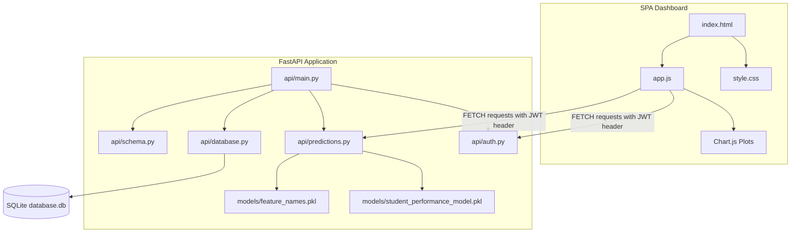

# Gradely AI: Student Performance Predictor & Dashboard

An end-to-end, production-ready machine learning web application that predicts a student's final grade (G3) using academic, demographic, and behavioral features. Powered by a **FastAPI** backend and an interactive **Single Page Application (SPA)** frontend dashboard.

---

## Key Features

1. **Machine Learning Inference**: A Gradient Boosting Regressor (trained on the Student Performance dataset) that predicts final grades (0-20) in real-time.
2. **Interactive SPA Dashboard**: Modern, responsive dashboard utilizing HSL-based color variables, custom scrollbars, and fluid layouts (collapsible sidebar navigation, metrics widgets, forms, tables).
3. **Advanced Tabbed Wizard Form**: Organizes the 32 required dataset features into 3 manageable steps: *Academic*, *Personal & Family Background*, and *Lifestyle & Habits*.
4. **Actionable Recommendations Engine**: Automatically analyzes input factors (e.g. absences, study time, failures) and outputs personalized student counseling recommendations.
5. **Real-time Analytics**: Renders dynamic charts with **Chart.js** displaying prediction history trends, risk distributions, and study habit comparisons.
6. **Robust SQLite Database**: SQLite database tracking user registration, authentication, and prediction inference history logs.
7. **JWT Authentication**: Secured routers supporting user registration, secure login with bcrypt password hashing, and token verification.
8. **DevOps & Containerization**: Fully dockerized environment with `Dockerfile` and `docker-compose.yml` for unified development or cloud hosting.
9. **Dark & Light Themes**: Sleek default dark-theme with smooth transitions to a high-contrast light-theme.

---

## System Architecture



---

## Directory Structure

```
student-performance-predictor/
├── api/
│   ├── __init__.py
│   ├── auth.py          # JWT authentication, register, login, & profile routes
│   ├── database.py      # SQLAlchemy SQLite engine, session, & User/Prediction models
│   ├── main.py          # FastAPI entry point, CORS, logging, & static assets mount
│   ├── predictions.py   # Machine learning inference, logs retrieval, & recommendations
│   └── schema.py        # Pydantic validation schemas & categorical string translation
├── data/
│   └── database.db      # Automatically created SQLite database
├── frontend/
│   ├── app.js           # Client SPA state, wizards, Chart.js renderers, & auth hooks
│   ├── index.html       # Single Page Application structure
│   └── style.css        # Responsive CSS layout system (variable-based Dark/Light themes)
├── models/
│   ├── feature_names.pkl           # List of 32 features expected by the model
│   └── student_performance_model.pkl  # Trained Gradient Boosting Regressor model
├── notebooks/
│   └── eda.ipynb        # Exploratory Data Analysis & training workbook
├── src/
│   └── predict.py       # Standalone CLI model validation script
├── .env                 # Environment secrets (JWT key, Database URL)
├── .gitignore           # Git untracked pattern file
├── Dockerfile           # App image packaging instructions
├── docker-compose.yml   # Multi-container service configuration
├── requirements.txt     # Python packages lists
└── README.md            # Document overview & deployment guide
```

---

## Local Setup & Installation

### Prerequisites
- Python 3.10 or higher
- Git

### 1. Clone the Repository & Configure Env
Navigate to the project root and create a `.env` file:
```env
DATABASE_URL=sqlite:///./data/database.db
SECRET_KEY=your_secure_random_jwt_secret_key_here
ALGORITHM=HS256
ACCESS_TOKEN_EXPIRE_MINUTES=60
```

### 2. Set Up Virtual Environment & Dependencies
Create and activate a python virtual environment, then install requirements:
```bash
# Windows PowerShell
python -m venv venv
.\venv\Scripts\Activate.ps1

# Install required packages
pip install -r requirements.txt
```

### 3. Run the Backend API Server
Start the development server using Uvicorn:
```bash
uvicorn api.main:app --reload
```
The application will launch. Open your browser and navigate to:
- **Application Dashboard**: [http://127.0.0.1:8000](http://127.0.0.1:8000)
- **Interactive Swagger Docs**: [http://127.0.0.1:8000/docs](http://127.0.0.1:8000/docs)

---

## DevOps & Docker Deployment

### Run with Docker Compose
If you have Docker and Docker Compose installed, you can build and start the entire app with a single command. This builds the Python image, configures local sqlite persistence in the `./data/` folder, and exposes port 8000:

```bash
# Build and run containers
docker-compose up --build -d

# Check running logs
docker-compose logs -f

# Shutdown services
docker-compose down
```

---

## API Documentation

### Authentication Routes (`/api/v1/auth`)
- `POST /register`: Registers a new user account.
  - Request: `{ "username": "...", "email": "...", "password": "..." }`
- `POST /login`: Log in to retrieve a bearer token. Returns `{ "access_token": "...", "token_type": "bearer" }`.
- `GET /me`: Returns the current authenticated user's ID, username, and email.

### Prediction & Analytics Routes (`/api/v1`)
- `POST /predict`: Running inferences. Expects a JSON object containing all 32 parameters (with human-readable string values for categoricals). Returns the predicted grade, evaluation rating, and a list of study improvements.
- `GET /predictions`: Fetches the history log of predictions submitted by the authenticated user.
- `DELETE /predictions/{id}`: Deletes a specific prediction history record.

### Utility Routes
- `GET /api/v1/health`: Simple API health check returning `{"status": "healthy", "version": "1.0.0"}`.

---

## Model Categorical Encodings

The machine learning model expects numerical features. When string labels are submitted via the API, the backend schema (`api/schema.py`) automatically maps them to their encoded integer equivalents using the mapping listed below:

| Feature Name | Client String Inputs | Encoded Integer Mapping |
| :--- | :--- | :--- |
| `school` | `"GP"`, `"MS"` | `{"GP": 0, "MS": 1}` |
| `sex` | `"F"`, `"M"` | `{"F": 0, "M": 1}` |
| `address` | `"R"`, `"U"` | `{"R": 0, "U": 1}` |
| `famsize` | `"GT3"`, `"LE3"` | `{"GT3": 0, "LE3": 1}` |
| `Pstatus` | `"A"`, `"T"` | `{"A": 0, "T": 1}` |
| `Mjob` / `Fjob` | `"at_home"`, `"health"`, `"other"`, `"services"`, `"teacher"` | `{"at_home": 0, "health": 1, "other": 2, "services": 3, "teacher": 4}` |
| `reason` | `"course"`, `"home"`, `"other"`, `"reputation"` | `{"course": 0, "home": 1, "other": 2, "reputation": 3}` |
| `guardian` | `"father"`, `"mother"`, `"other"` | `{"father": 0, "mother": 1, "other": 2}` |
| yes/no fields* | `"no"`, `"yes"` | `{"no": 0, "yes": 1}` |

*\*Includes: `schoolsup`, `famsup`, `paid`, `activities`, `nursery`, `higher`, `internet`, `romantic`*
